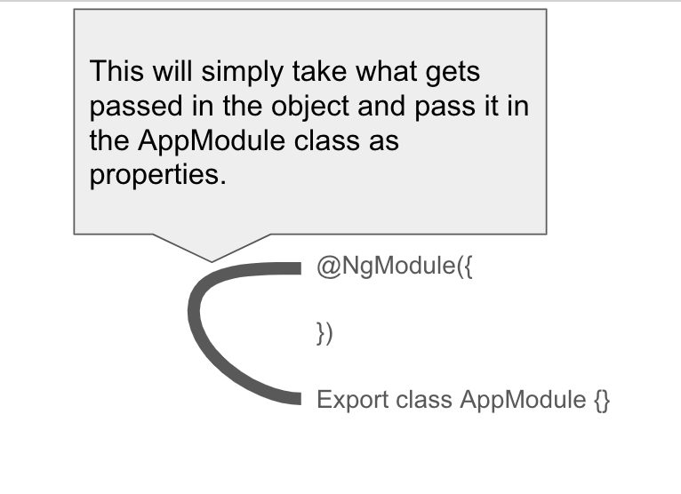

# Angular Learning: @NgModule

<h1>1. @NgModule</h1>

   - ## <span style="font-family:Lucida Console;">What is a decorator ?:</span> 
   >
   > decorators are a design pattern that is used to separate `modification` or `decoration` of a class without modifying the original source code. In AngularJS, decorators are functions that allow a service, directive or filter to be modified prior to its usage
   > 
   - ## <span style="font-family:Lucida Console;">Breakdown:</span>
   > in simple terms it takes the `parameters` you pass in and pass them into your class, `without` you having to `actually type` it in there yourself. 
   - 

   - ## <span style="font-family:Lucida Console;">What type of decorator is it ?:</span>
   > - `Module Decorator`

   - ## <span style="font-family:Lucida Console;">What does it do ?:</span>

   > - 

   -  ## Helpful Links:
      > [Angular Decorators](https://ultimatecourses.com/blog/angular-decorators#angular-decorators)

<h1>Coding Section:</h1>

```ts
// Imports go here:
import {NgModule} from '@angular/core';


// Code goes here:
@NgModule({
   declarations: [],
   imports: [],
   providers: [],
   bootstrap: []
})
export class AppModule {}
```

***

# Angular Learning: Components

<h1>2. @Component</h1>

   - ## <span style="font-family:Lucida Console;">Properties</span> 
   > - 

   - ## <span style="font-family:Lucida Console;">What type of decorator is it ?:</span>
   > - `Component Decorator`

   - ## <span style="font-family:Lucida Console;">What does it do ?:</span>
      - `connects` properties passed in to your component.

   -  ## Helpful Links:
      > [Angular Component Decorators Explained](https://ultimatecourses.com/blog/angular-decorators#class-decorators)
      
      > [List of all component decorator properties](https://angular.io/api/core/Component)

<h1>Coding Section:</h1>

```ts

```


